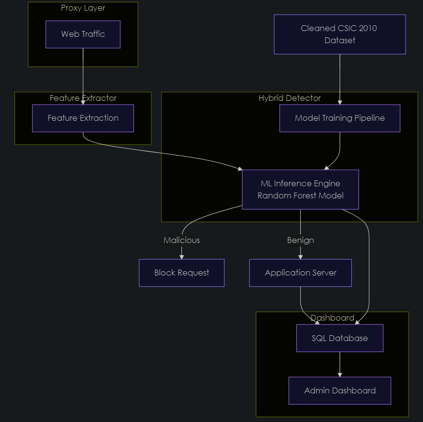

# AI-Driven Web Application Firewall (WAF)

AI WAF is a project that implements an AI-powered Web Application Firewall that combines machine learning (Random Forest)to protect web applications from advanced threats such as SQL injection, XSS, and other injection attacks. The system features a robust training pipeline, real-time proxy filtering, and a modern dashboard for monitoring and analytics.

---

## Features


- **Advanced Model Training:** Uses Random Forest classification with Bayesian hyperparameter optimization and SMOTE for handling class imbalance
- **Feature Engineering:** Extracts meaningful features from HTTP requests including payload length, special character counts, and keyword detection
- **Explainability:** SHAP-based feature importance visualization for understanding model decisions
- **Real-Time Proxy:** HTTP proxy that blocks malicious requests before they reach the backend
- **Attack Classification:** Detects and categorizes SQL Injection, XSS, Path Traversal, Parameter Tampering, and Directory Scanning
- **Dashboard:** Flask-based dashboard for real-time attack monitoring and analytics
- **Extensive Logging:** All components log key events for traceability and debugging

---

## Technical Architecture


The WAF operates as a reverse proxy that:

1. **Intercepts HTTP requests** before they reach your application server
2. **Extracts key features** from the request URL, parameters, and headers
3. **Classifies the request** using a pre-trained Random Forest model
4. **Blocks malicious requests** with confidence scores above 0.5
5. **Logs attack details** to SQLite database for monitoring and analysis
6. **Forwards legitimate requests** to the protected application

The machine learning pipeline uses:

- **Random Forest classifier** for high accuracy and resistance to overfitting
- **SMOTE** to address class imbalance in attack vs. normal request data
- **Bayesian optimization** to find optimal hyperparameters
- **SHAP values** to explain model decisions and identify important features

---

## 📁 Project Structure

```
.
├── Backend/
│   ├── allowed.html
│   ├── backend.py
│   ├── blocked.html
│   └── database.py
├── Dashboard/
│   ├── app.py
│   └── templates/
│       ├── dashboard.html
│       └── index.html
├── data/
│   ├── data_loader.py
│   ├── processed/
│   └── raw/
├── waf_scripts/
│   ├── proxy.py        # HTTP proxy with ML-based filtering
│   └── train_model.py  # ML pipeline for model training
├── .gitignore
└── requirements.txt
```

- **Backend/**: Core backend logic, database interactions, and HTML templates for allowed/blocked pages
- **Dashboard/**: Flask-based dashboard web app for attack monitoring and visualization
- **data/**: Data loader script and folders for raw/processed request data (data files are git-ignored)
- **waf_scripts/**:
  - **proxy.py**: Implements the HTTP proxy with ML-based and rule-based filtering
  - **train_model.py**: ML pipeline for feature engineering, model training, and evaluation
- **models/**, **logs/**: Model storage and logging directories (git-ignored)
- **requirements.txt**: Python dependencies

---

## Key Components

### Proxy Server (waf_scripts/proxy.py)

The proxy server:

- Intercepts HTTP requests on port 8080
- Extracts features such as:
  - Request length
  - Number of semicolons
  - Presence of SQL keywords
  - Count of special characters
  - Presence of HTTP methods in the payload
- Predicts attack probability using the Random Forest model
- Classifies attack types (SQL Injection, XSS, etc.)
- Blocks malicious requests and serves a warning page
- Logs attacks to a SQLite database

### Model Training (waf_scripts/train_model.py)

The training pipeline:

- Processes raw HTTP request data
- Performs feature engineering and extraction
- Applies SMOTE to balance attack/normal classes
- Uses Bayesian optimization for hyperparameter tuning
- Trains the Random Forest classifier
- Evaluates model performance
- Generates SHAP visualizations for model explainability
- Saves the trained model for use by the proxy

---

## Setup Instructions

### 1. **Clone the Repository**

```bash
git clone https://github.com/akshanthsaik/WAF.git
cd WAF
```

### 2. **Create and Activate a Virtual Environment**

```bash
python -m venv venv
# On Windows:
venv\Scripts\activate
# On macOS/Linux:
source venv/bin/activate
```

### 3. **Install Dependencies**

```bash
pip install -r requirements.txt
```

### 4. **Run the Application**

- **Backend**:
  ```bash
  python Backend/backend.py
  ```
- **Dashboard**:
  ```bash
  python Dashboard/app.py
  ```
- **Model Training**:
  ```bash
  python waf_scripts/train_model.py
  ```
- **Proxy Server**:
  ```bash
  python waf_scripts/proxy.py
  ```

> **Note:**  
> Data files and trained models are not tracked in Git. Place your data in the appropriate `data/raw/` or `data/processed/` folders as needed. The proxy expects a trained model at `models/waf_model.pkl`.

---

## Configuration

The WAF's behaviour can be customized by modifying:

- Attack detection thresholds in proxy.py (default: 0.5)
- SQL keywords and pattern detection in the `detect_attack_type` function
- Whitelist paths for trusted requests

---

## Notes

- Only `data/data_loader.py` is tracked in git; all other data and model files are ignored for security and size reasons.
- Update `requirements.txt` if you add new dependencies.
- For development, use the provided virtual environment setup for consistency.
